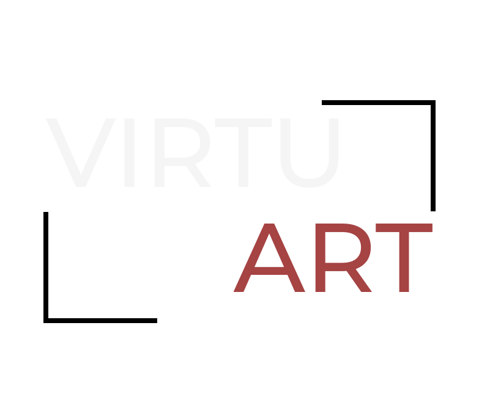

# 🖼️VirtuArt 🖌️

## Description:

**VirtuArt** est une application innovante **fullstack** dans le cadre du _projet 3_ du bootcamp à la **WildCodeSchool**, disponible sur mobile et desktop, conçue pour offrir une expérience immersive dans une galerie d'art virtuelle. Cette plateforme permet aux artistes de publier et d'exposer leurs œuvres, tout en offrant aux utilisateurs la possibilité de découvrir des créations modernes et des chefs-d'œuvre historiques. Les membres de la communauté peuvent participer à des événements en ligne et des webinaires exclusifs, enrichissant ainsi leur expérience artistique. **VirtuArt** combine une interface élégante et fonctionnelle, offrant à la fois une exploration visuelle captivante et une interaction dynamique avec les artistes.

## 📥 Installation

1. Clonez le dépôt :

   ```sh
   git clone git@github.com:WildCodeSchool-2024-02/JS-RemoteFR-CodeOfWar-P3-afac974.git
   ```

2. Installez les dépendances :

   ```sh
   cd JS-RemoteFR-CodeOfWar-P3-afac974
   npm install
   ```

3. Démarrez le client et le serveur :

   ```sh
   npm run dev
   ```

## 🛠️ Utilisation

`Bientôt disponible`.

## 📦 Paquets npm

### `/client`

`Bientôt disponible`.

### `/server`

`Bientôt disponible`.

## 🖼️ Screenshots


## ✍ Créateur

- [Baptiste <br>
  ](https://github.com/BaptisteFredj)
- [Clément <br>
  ](https://github.com/Agraheris)
- [Damien <br>
  ](https://github.com/dampherrr)
- [Daniel <br>
  ](https://github.com/Ryokoh-974)
- [Monica <br>
  ](https://github.com/monica-tech75)

## 🔧 Déploiement

Pour déployer **VirtuArt**, suivez les instructions de configuration de votre environnement de déploiement et assurez-vous que toutes les variables nécessaires sont correctement configurées. Consultez la documentation de votre solution de déploiement pour plus de détails sur les étapes spécifiques.

## 📝 Licence

Ce projet est sous licence [MIT](LICENSE).
